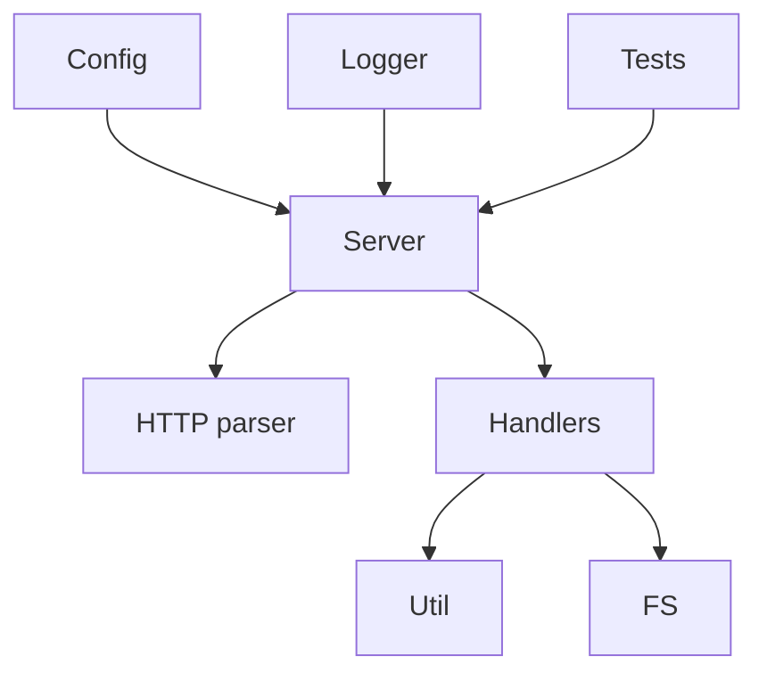
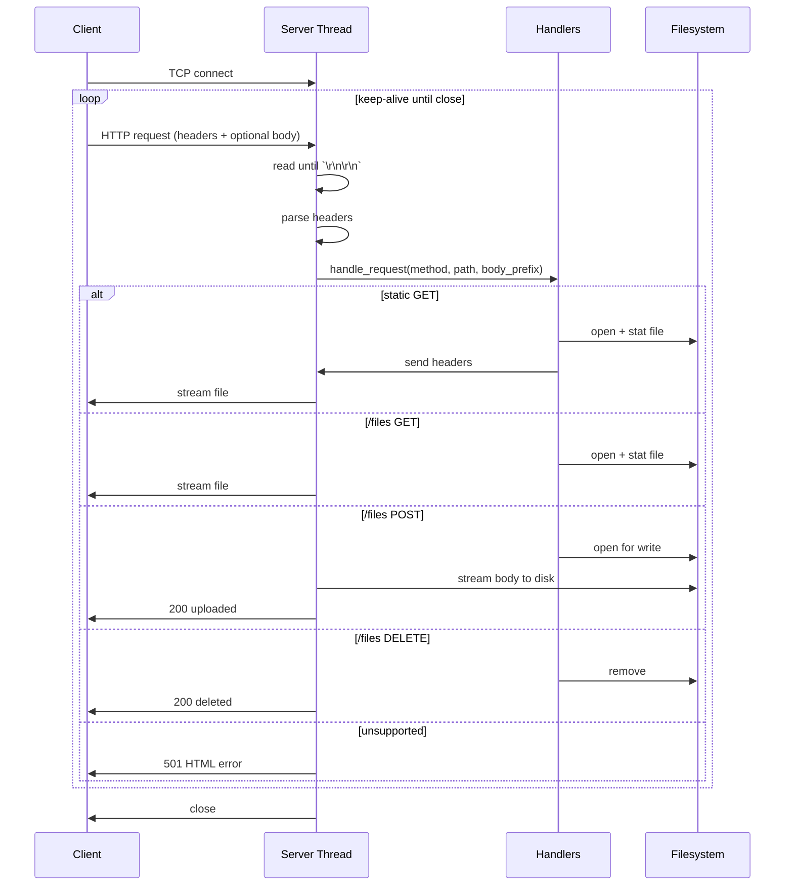

# HLD.md

## Component diagram

## Main modules
### Logger
- Thread-safe logging
- Levels: FATAL/ERROR/WARN/INFO/DEBUG
- Output: stdout + optional file

### Config
- Loads JSON into `ServerConfig`
- Applies defaults and validates ranges

### HTTP core
- Parses request line + headers
- Builds response headers
- Parses Content-Length for requests

### Utilities + Path Security
- URL decode (`%XX`, `+`)
- HTML escaping + error page generation
- Safe path join under root directory.

### Server core
- TCP socket bind/listen/accept on configured ip:port
- Concurrency model: thread-per-connection
- Enforces max concurrent clients (503 if exceeded)
- Keep-alive loop:
  - HTTP/1.1 keep-alive default unless `Connection: close`
  - HTTP/1.0 close default unless `Connection: keep-alive`
- Reads header until `\r\n\r\n`, then passes to handler

### Handlers
- Routes based on method + path:
  - Static GET from root
  - Storage `/files/*` for GET/POST/DELETE
- Streams files using `sendfile` or fallback chunk loop
- Upload streams request body directly to disk

## Request lifecycle

## Status codes
- 200 OK: success
- 400 Bad Request: malformed HTTP, missing Content-Length on POST, oversized headers, invalid paths
- 403 Forbidden: traversal attempt, directory listing forbidden, non-regular file operations
- 404 Not Found: missing file
- 501 Not Implemented: unsupported method
- 503 Service Unavailable: max clients reached, IO failures
